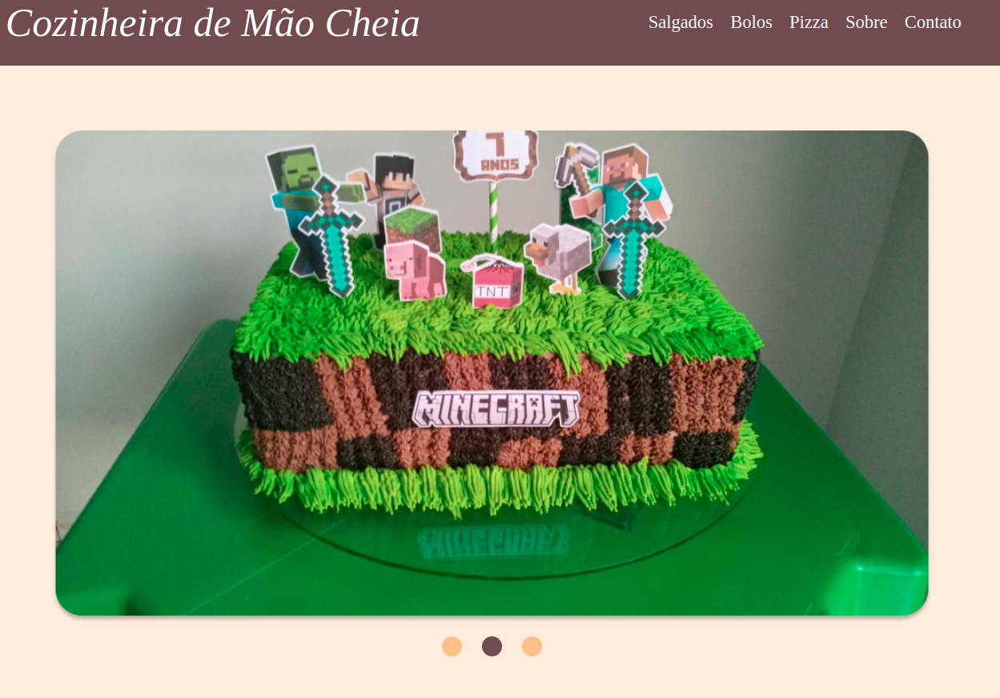

# Cozinheira-de-mão-cheia

---

## 💻 **Tecnologias**

Esse projeto foi desenvolvido com essas tecnologias:

- [HTML](https://developer.mozilla.org/pt-BR/docs/Web/HTML)
- [CSS](https://developer.mozilla.org/pt-BR/docs/Web/CSS)
- [JavaScript](https://developer.mozilla.org/pt-BR/docs/Web/JavaScript)

---

## 🎨 **Layout**

Você pode visualizar o layout do projeto através desse [link](https://www.figma.com/file/529FzegqtZnR1f0R0ZMoMs/boloshow?node-id=0%3A1).

Obs: É necessário ter uma conta no figma.

---

## 🚀 **Projeto**

Esse projeto foi um desenvolvido a partir do pedido da minha mãe, pois ela queria um site para mostrar um pouco do trabalho dela.

E para realizar isso, eu utilizei o conhecimento adquirido durante o curso da [Rocketseat](https://app.rocketseat.com.br/discover).
# Cozinheira-Edineta
